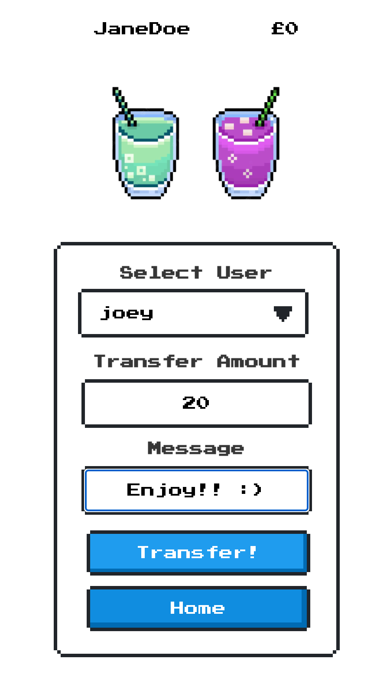

# Drinks On Me!

<p align="center">
  
</p>


<p>
A full stack social media app that lets users send money for drinks with a message to other users, and to spend that money at participating pubs. The app was built in the span of around 10 days, for the fourth project at General Assembly's Software Engineering Immersive course.
</p>

## Deployed App
- Run the [deployed application](https://drinks-on-me-jtb.netlify.app/)!
  - Feel free to register and then use your own login credentials.

## Application Walkthrough
### Landing and Register
<p align="center">
  
  
</p>

###  Login and Home
<p align="center">
  
  
</p>

### Transfer and Purchase
<p align="center">
  
  
</p>


## Tech Stack
### Front End
- JavaScript/HTML/CSS
- React.js Framework (Single Page Application)
- API Handling: Axios
- React-Router-Dom

### Back End
- Server: Django & Django Rest Framework
- Database: PostgreSQL
- Authentication: JSON Web Token (pyJWT)

### Development
- Git, GitHub
- Postman (API testing)
- Excalidraw (wireframing, planning)
- Npm & Pipenv
- Deployment:
  - Front End: Netlify
  - Back End: Heroku

## Features
- Topup your account
- Send money for drinks with a personal message to other users
- Select from participating pubs
- Buy drinks at participating pubs
- Log In, Register and Log Out functionality
- View a history of transfers and messages
- View a history of drinks purchased


## Planning & Wireframing:
### Whiteboarding (Excalidraw):
<p align="center">
  
</p>

### Entity Relationship Diagram (ERD via QuickDBD)
<p align="center">
  
</p>

## Architecture:
### Front End: 
- React Components to compartmentalise code
- React Hooks for component state management and handling side effects
- NES CSS framework for a fun retro feel
- Single Page Application (`react-router-dom`) using `Link`, `useNavigate`, `useLocation` and `useParams`
### Back End:
- 5 tables/models in PostgreSQL 
- All security checks (user access credentials) done in Django in the back end:
  - Email validation
  - Password encryption
  - Login credentials expire after 7 days


## Featured Code Snippets
### Front End
#### Some React bits
```
insert some cool code bits here!

```

### Back End
#### Some Django bits
```

insert some cool django rest api code bits here....

from django.db import models
from django.contrib.auth import get_user_model


```

## Wins & Challenges

## Future Improvements